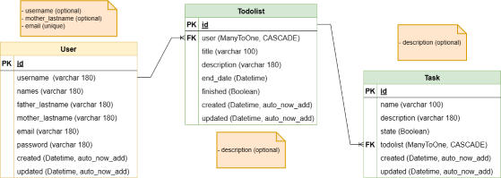
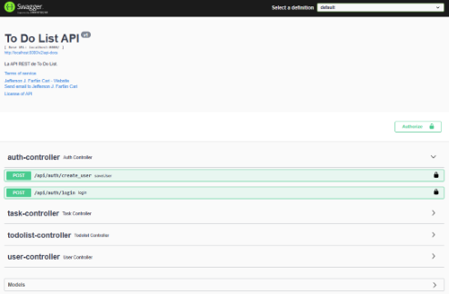
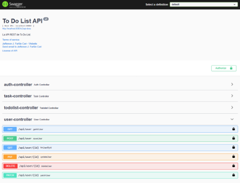
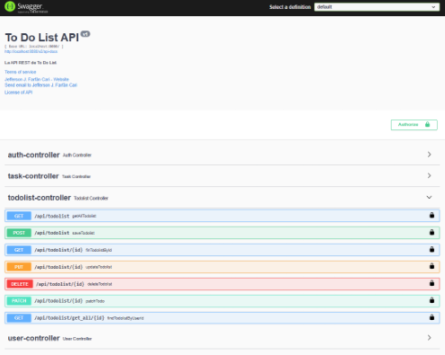
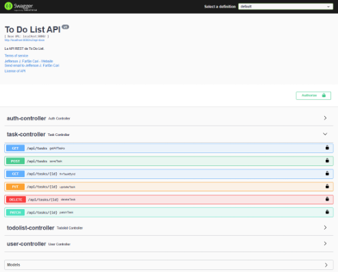

# ToDoList API System
This project was build with Java (17), Springboot (2.7.8), SpringSecurity (3.0.2), PostgreSQL (14.6)  


### Installation
- This project works with Java, Springboot, and PostgreSQL Database

**1. Clone the project**
~~~  
https://github.com/Jefferson-J-Farfan-Cari/todolistapp.git
~~~

### Execution of project

**1. Run backend development server**
- Is necessary set the variables of your database in **application.properties** file in:
~~~
src/main/resources/application.properties
~~~
- Build the dependencies in **pom.xml** file
~~~
\app\pom.xml
~~~
- Start backend development server.
~~~
mvnw.cmd spring-boot:run
~~~
- Stop backend development server.
~~~
Ctrl + C in your console or command line
~~~
- The backend project must be running in http://localhost:8080/
- Swagger must be running in http://localhost:8080/swagger-ui/#/

### Creating and login with user

1. First go to **Auth EP**.
2. Second create your user in the ```create_user``` post.
3. Then you have two ways of login:
   1. Login with a Token
      1. In the **Auth EP** go to ```login``` post and insert your ```email and password```
      it will generate a token.
      2. Then click in ```Authorize button``` and introduce that token in ```JWT (ApiKey)``` box as the 
      following example ```Bearer + token```. 
   2. Login with Basic Auth
      1. Go to ```Basic Authorization``` form and complete it with your email and password.
4. On the other hand, if you use postman you should make a basic login with your own credentials email and pass.
    Or also, you can use the ```login```ep to generate a token.

### Images and Screenshots of Rest API

**1. Database design**  
   

**2. Swagger Login**  


**3. Swagger Auth**  


**4. Swagger User End points**  


**5. Swagger TodoList End points**  


**6. Swagger Task End points**  
  